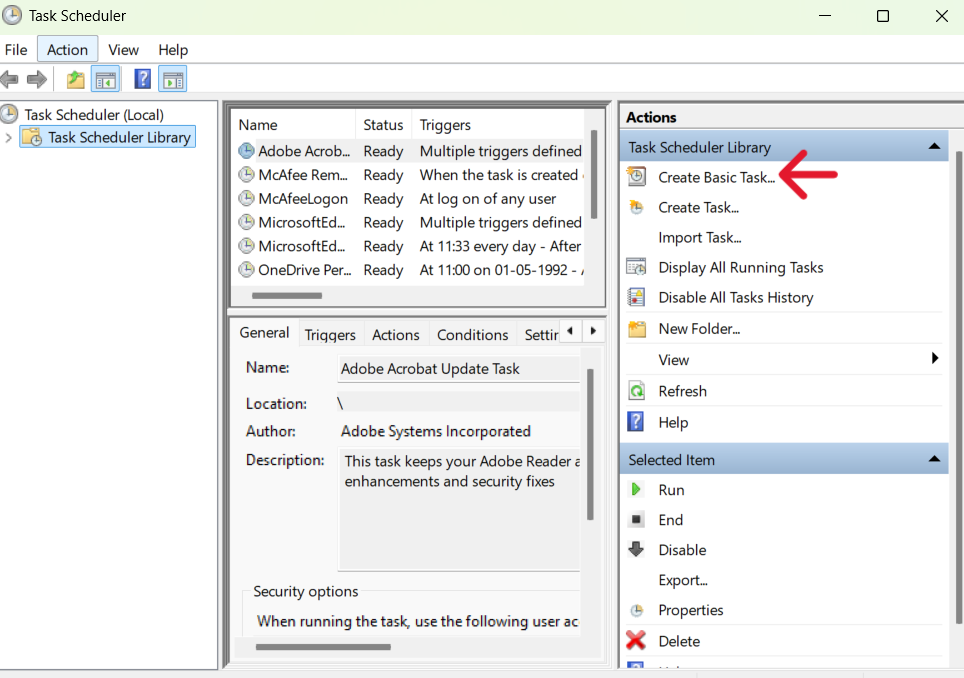
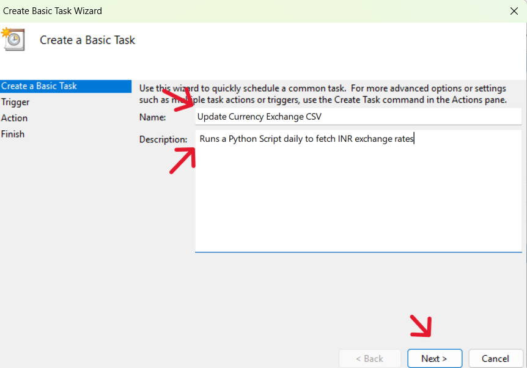

# Setting Up Windows Task Scheduler for Currency Scraper

This guide walks you through automating your Python script (`currency_scraper.py`) using Windows Task Scheduler so it runs daily and updates your currency exchange CSV file.

## Prerequisites

- Python installed (check with `where python` in CMD)
- Your Python script: `currency_scraper.py`
- A folder for saving your `.csv` (e.g., `data/`)
- Windows OS with access to Task Scheduler

## Step-by-Step Setup

### Step 1: Open Task Scheduler

1. Press `Win + S` and search for **Task Scheduler**
2. Open the application  
3. Click **Create Basic Task**

### Step 2: Name & Describe the Task

- Name: `Update Currency Exchange CSV`
- Description: "Runs a Python script daily to fetch INR exchange rates"

