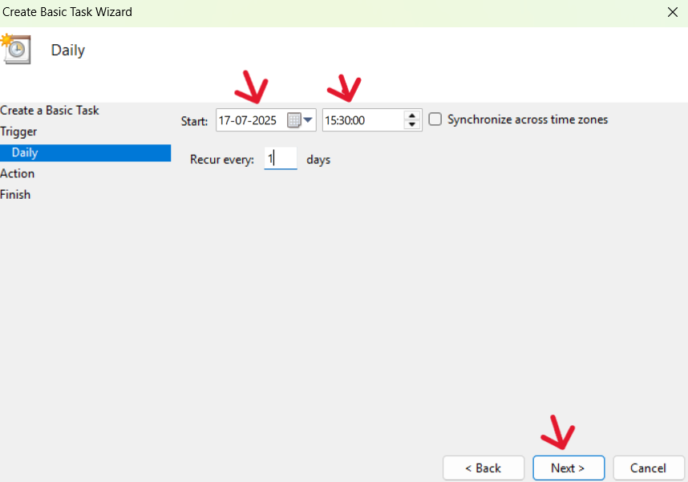
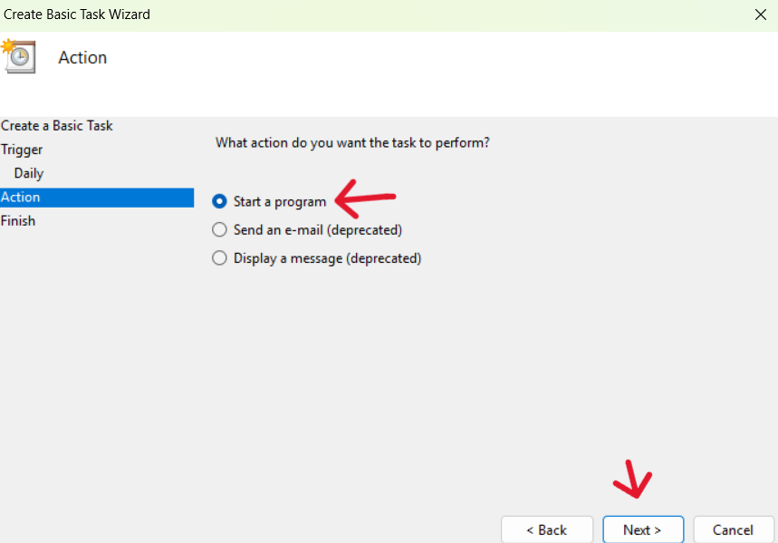
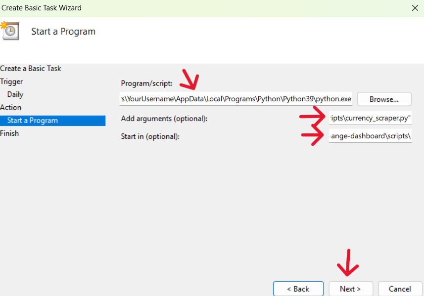
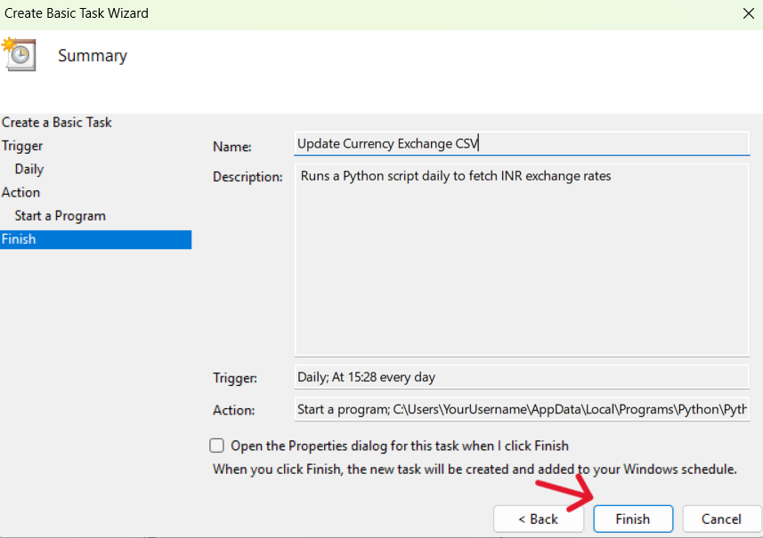

# Setting Up Windows Task Scheduler for Currency Scraper

This guide walks you through automating your Python script (`currency_scraper.py`) using Windows Task Scheduler so it runs daily and updates your currency exchange CSV file.

## Prerequisites

- Python installed (check with `where python` in CMD)
- Your Python script: `currency_scraper.py`
- A folder for saving your `.csv` (e.g., `data/`)
- Windows OS with access to Task Scheduler

## Step-by-Step Setup

### Step 1: Open Task Scheduler

1. Press `Win + S` and search for **Task Scheduler**
2. Open the application  
3. Click **Create Basic Task**

### Step 2: Name & Describe the Task

- Name: `Update Currency Exchange CSV`
- Description: "Runs a Python script daily to fetch INR exchange rates"

### Step 3: Set Trigger

- Choose **Daily**
- Set the time (e.g., `9:00 AM`)
- Click **Next**

### Step 4: Set the Action

- Choose **Start a program**

### Step 5: Add Program Details

- **Program/script**: path to your Python executable  
  Example: C:\Users\YourUsername\AppData\Local\Programs\Python\Python39\python.exe

- **Add arguments**: full path to your script  
Example: "C:\Users\YourUsername\Documents\currency-exchange-dashboard\scripts\currency_scraper.py"

- **Start in**: (optional but safer)  
C:\Users\YourUsername\Documents\currency-exchange-dashboard\scripts\

### Step 6: Finish Setup

- Review all settings
- Click **Finish**

